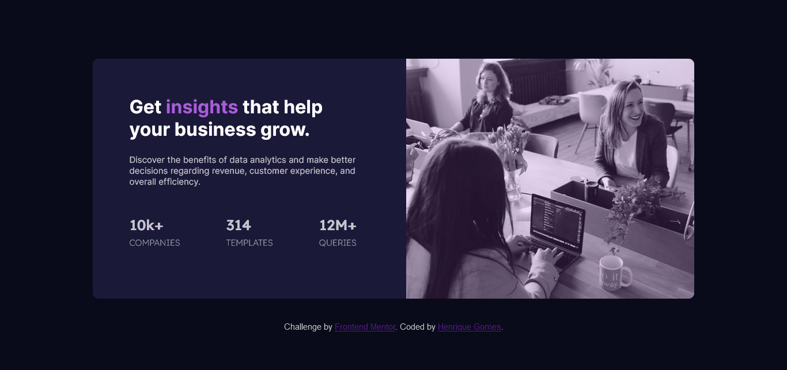
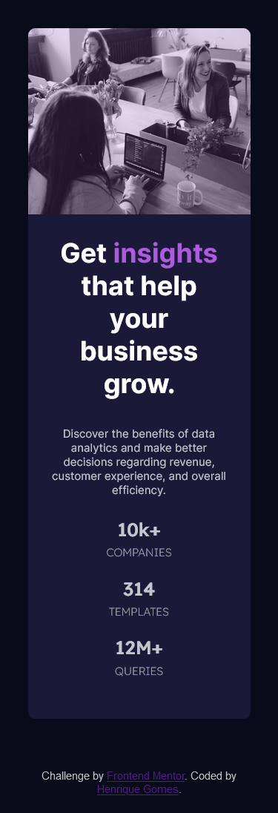

# Frontend Mentor - Stats preview card component solution

This is a solution to the [Stats preview card component challenge on Frontend Mentor](https://www.frontendmentor.io/challenges/stats-preview-card-component-8JqbgoU62). Frontend Mentor challenges help you improve your coding skills by building realistic projects. 

## Table of contents

- [Overview](#overview)
  - [The challenge](#the-challenge)
  - [Screenshot](#screenshot)
  - [Links](#links)
- [My process](#my-process)
  - [Built with](#built-with)
  - [What I learned](#what-i-learned)
  - [Continued development](#continued-development)
  - [Useful resources](#useful-resources)
- [Author](#author)

## Overview

### The challenge

Users should be able to:

- View the optimal layout depending on their device's screen size

### Screenshot

#### Desktop view


#### Mobile view


### Links

- Solution URL: [HTML & CSS Code](https://github.com/oihenrique/frontend-mentor-challenges/tree/main/01.%20%5Bhtml-css%5D%20Stats%20Preview%20Card%20Component)
- Live Site URL: [Live site visualization](https://oihenrique.github.io/frontend-mentor-challenges/01.%20[html-css]%20Stats%20Preview%20Card%20Component/index.html)

## My process

### Built with

- Semantic HTML5 markup
- CSS custom properties
- Flexbox

### What I learned

In this project, I learned about how to positioning elements with Flexbox, using the ```justify-content``` and the ```flex-direction```.

```css
.container {
    display: flex;
    justify-content: space-between;
}
```
```css
@media (max-width: 991px) {
  .container {
      flex-direction: column-reverse;
  }
}
```
___

I learned how to use the tag ```<picture>``` to change the images according to the screen size.
~~~html
<div class="card-img">
  <picture>
    <source src="images/image-header-mobile.jpg" media="max-width: 375px">
    
  </picture>
</div>
~~~

___

To separate a container from the body, add some padding and don't use "em" as a metric to it, because it won't be resposive, it will be fixed according to the font-size, so, I used percentage.

~~~css
body {
    background-color: hsl(233, 47%, 7%);
    font-size: 15px;
    overflow-x: hidden;
    padding: 7.5%;
}
~~~

___

- Use ```max-width``` to control the size of your boxes;
- Don't use "image" in the ```alt``` of the image tags, the screen readers know that it is a image;
- If the image is just decorative, doesn't need add a ```alt``` in the image tag.

### Continued development

- I want to continue learning about Flexbox, I still have trouble positioning the elements on the page. 

- I need more practice to fix HTML tags and how the &lt;div&gt; inside another &lt;div&gt; are related each other.

- I need to practice responsivity and the mobile pages development, I had trouble trying to fix the main container size and the image inside of it.

### Useful resources

- [MDN - Web Docs](https://developer.mozilla.org/pt-BR/) - I used this site to research HTML tags, CSS properties and Flexbox;
- [MDN - Basics of Flexbox](https://developer.mozilla.org/pt-BR/docs/Web/CSS/CSS_Flexible_Box_Layout/Basic_Concepts_of_Flexbox) - This helped me to learn how Flexbox works;
- [MDN - Picture element](https://developer.mozilla.org/en-US/docs/Web/HTML/Element/picture) - This will be helpful to learn how to use the `<picture>` tag.
- [MDN - CSS Units](https://developer.mozilla.org/en-US/docs/Learn/CSS/Building_blocks/Values_and_units) - This is important to understand what unit use to define some element size.

## Author

- Github - [My github profile](https://github.com/oihenrique)
- Frontend Mentor - [@oihenrique](https://www.frontendmentor.io/profile/oihenrique)
- Linkedin - [Mu linkedin profile](https://www.linkedin.com/in/oihenriquegomes/)